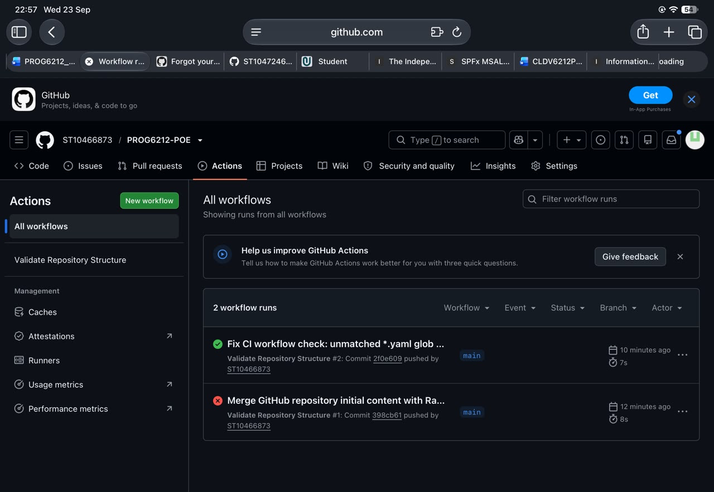

# RaceDay

**PROG6212 — Programming 2B · Portfolio of Evidence**
**Current status:** Part 1 — System Planning and Database ✅ · Part 2 — RESTful API (planned) · Part 3 — MVC Web Application (planned)

---

## 1. System description

**RaceDay** is a full-stack, web-based event management system built for the South African road running, walking and cycling community — from the Comrades Marathon and Two Oceans down to weekend park runs and charity cycles. Despite the enormous participation these events attract, many organisers still manage them through paper-based registration, spreadsheets and disconnected communication channels.

RaceDay replaces that with a single platform where **Event Organisers** create and manage events, categories and participant results, while **Participants** browse upcoming events, enter them by choosing a category, track their personal performance history, and prepare for race day using live weather and route information. The system is designed up front to be API-driven, cloud-aware and fully containerised by the final part.

## 2. The two roles

| Role | Capabilities |
|---|---|
| **Organiser** | Create, edit and delete events; manage event categories (age and distance, e.g. Under 20, Senior, 10km, 21km); capture participant results (finish times and finishing positions); view all enrolments for their events. |
| **Participant** | Create an account; browse events; enter an event by selecting a category; view their own enrolments; track their personal results. |

Role-based access is enforced at the API level in Part 2 and reflected consistently in the MVC interface in Part 3.

## 3. Repository structure

```
/
├── README.md                          ← this file
├── .github/workflows/
│   └── validate-structure.yml         ← CI: validates the repository structure
└── docs/
    ├── RaceDay_ERD.png                ← Section A: Entity Relationship Diagram
    ├── RaceDay_ERD.svg                ← editable source of the ERD
    ├── api-endpoint-plan.md           ← Section B: API endpoint plan
    ├── RaceDayDatabase.sql            ← Section C: full SQL schema + seed data
    └── tests/
        └── RaceDay_Database_Tests.sql ← 22 tests: every table, constraint and integrity rule
```

## 4. Setup instructions

### 4.1 View the planning documents
No tooling required — open `docs/api-endpoint-plan.md` and `docs/RaceDay_ERD.png` directly in GitHub.

### 4.2 Run the SQL script (SQL Server Management Studio — SSMS)
1. Open **SQL Server Management Studio** and connect to your SQL Server instance (e.g. `localhost` or `.\SQLEXPRESS`).
2. Click **File → Open → File…** and select `docs/RaceDayDatabase.sql`.
3. Press **F5** (or click **Execute**) to run the script on a clean instance.
4. The script creates the `RaceDay` database, all eight tables with their primary keys, foreign keys and constraints, supporting indexes, and seeds realistic sample data (2 Organisers, 4 Participants, 3 Events, 3 routes, 9 categories, 7 enrolments, 5 results and 2 sessions).
5. Verify with `USE RaceDay; SELECT * FROM dbo.Events;`.
6. **Run the test suite:** open `docs/tests/RaceDay_Database_Tests.sql` and press **F5**. It tests every table, constraint and relationship (22 tests) and finishes with `ALL TESTS PASSED` — it never modifies your data (all inserts are rolled back).

The script is re-runnable: it drops and recreates the `RaceDay` tables if they already exist.

### 4.3 Run the CI check locally (optional)
```bash
bash -c 'set -e; [ -f docs/RaceDay_ERD.png ] && [ -f docs/api-endpoint-plan.md ] && [ -f docs/RaceDayDatabase.sql ] && echo Structure OK'
```
The authoritative check runs on every push — see below.

## 5. CI/CD

The GitHub Actions workflow at [`.github/workflows/validate-structure.yml`](.github/workflows/validate-structure.yml) runs on every push and pull request. It validates that the `/docs` folder exists and contains the required deliverables (ERD image, endpoint plan with all six required columns, SQL script defining at least six tables plus seed data), and that a CI workflow is present.

**Screenshot of a successful green build:**



## 6. Marking deliverables checklist (Part 1)

- [x] `/docs` folder with ERD (PNG), endpoint plan (Markdown) and SQL script
- [x] ERD with 8 entities, primary keys, foreign keys and cardinality on every relationship
- [x] Endpoint plan with all six required columns covering all Part 2 functional requirements (22 endpoints)
- [x] SQL script runs on a clean SQL Server instance and matches the ERD exactly
- [x] Database test suite — 22 tests covering every table, constraint, relationship and the brief's seed minimums
- [x] GitHub Actions workflow validating the repository structure
- [x] 20+ meaningful commits pushed to GitHub
- [x] CI green build screenshot in this README

## 7. AI tooling disclosure

AI tooling (an AI coding assistant) was used while preparing this portfolio, as permitted by the module instructions, and is disclosed here in line with the assignment requirement.¹ All planning content — the data model, endpoint design, seed data choices and this README — was directed, reviewed, corrected and approved by me before being committed, and the same disclosure applies to Parts 2 and 3 where AI assistance is used for planning, proofreading or coding.

> ¹ Assignment instruction 3: *"If you used AI tools in any part of your process (e.g., planning, proofreading, coding), disclose their use briefly in a footnote or comments section."*
